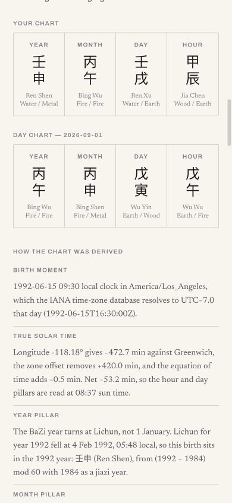

# MING

MING is an English-language Four Pillars (BaZi) product for a global audience. A visitor enters their birth date, recorded birth time, and birthplace to generate a real Four Pillars chart and a concise daily reading.

## Product Experience

- Product-first birth-information flow
- Four Pillars calculation using local solar time
- Personalized Today’s Signal with observation, theme, action, and reflection
- Expandable calculation and derivation details
- Responsive editorial interface with original Chinese calligraphy assets
- Conditions and choices, never deterministic prediction

## Screenshots

| Entry | Today’s Signal |
| --- | --- |
|  |  |

| Calculation | Brand story |
| --- | --- |
|  |  |

## Run Locally

```bash
pnpm install
pnpm dev
```

Open `http://localhost:3000`.

## Verification

```bash
pnpm validate:push
pnpm test:ming
pnpm build
```

The BaZi verification script checks published solar-term and sexagenary anchors, a fixed external fixture, 4,000 charts against an independent implementation, and output variation.

## Assignment Memo

The submission-ready memo is available at [docs/MING_Vibe_Coding_Project_Memo.docx](docs/MING_Vibe_Coding_Project_Memo.docx).
